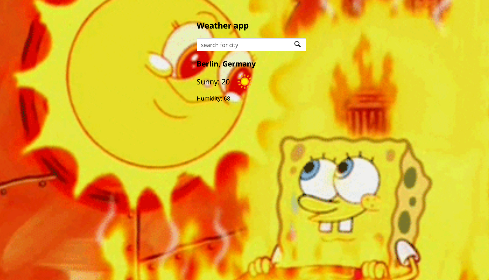

# Temp Teller

Weather app

## Features

- Get an instant tempreture for any city or country from weather api.
- Set the background of the website relevant to the tempreture.

### Acknowledgement

- This project was to practice my skills on async await and promises in javascript
  and also working with APIs.. [TOP](https://www.theodinproject.com/lessons/node-path-javascript-weather-app)
